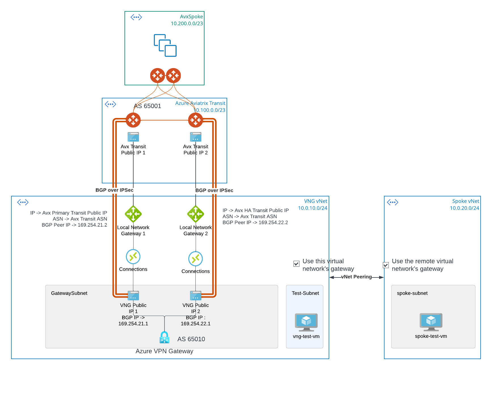

# terraform-aviatrix-lab-azure-vpn-gateway-bgp-over-ipsec-with-aviatrix-transit

This module create a lab environment, intergrating Azure VPN Gateway with Aviatrix Transit via BGP over IPSec.

Last tested with:
- Terraform: v1.2.8
- azurerm provider: 3.24.0
- Aviatrix Controller: 6.8.1149
- aviatrix provider: 2.24.0

Following architecture will be deployed:

  

- Aviatrix Transit establish two IPSec GRE tunnels with Azure VPN Gateway, both tunnels are active and Equal Cost Multi-Path (ECMP)
- Both Express Route Gateway and VPN Gateway are also called VNET Gateway (VNG)
- Aviatrix Spoke CIDR will be propagate to Spoke vNet on bottom right via VNG
- Spoke vNet and vNG vNet CIDR gets propagated to Aviatrix Transit via VNG
- Spoke vNet peering with VNG vNet while specifying use remote virtual network's gateway
- VNG vNet peering with Spoke vNet while specifying use this virtual network's gateway

Cost estimate

```
 Name                                                                          Monthly Qty  Unit                      Monthly Cost     

 azurerm_public_ip.vng_pip_1
 └─ IP address (dynamic)                                                               730  hours                            $2.92     

 azurerm_public_ip.vng_pip_2
 └─ IP address (dynamic)                                                               730  hours                            $2.92     

 azurerm_virtual_network_gateway.this
 ├─ VPN gateway (VpnGw2)                                                               730  hours                          $357.70     
 ├─ VPN gateway P2S tunnels (over 128)                                  Monthly cost depends on usage: $7.30 per tunnel
 └─ VPN gateway data tranfer                                            Monthly cost depends on usage: $0.035 per GB

 azurerm_virtual_network_gateway_connection.ha
 └─ VPN gateway (VpnGw2)                                                               730  hours                           $10.95     

 azurerm_virtual_network_gateway_connection.primary
 └─ VPN gateway (VpnGw2)                                                               730  hours                           $10.95     

 azurerm_virtual_network_peering.spoke_to_vng
 ├─ Inbound data transfer                                               Monthly cost depends on usage: $0.01 per GB
 └─ Outbound data transfer                                              Monthly cost depends on usage: $0.01 per GB

 azurerm_virtual_network_peering.vng_to_spoke
 ├─ Inbound data transfer                                               Monthly cost depends on usage: $0.01 per GB
 └─ Outbound data transfer                                              Monthly cost depends on usage: $0.01 per GB

 module.azure-linux-vm-public-spoke.azurerm_linux_virtual_machine.this
 ├─ Instance usage (pay as you go, Standard_B1s)                                       730  hours                            $7.59 
 └─ os_disk
    ├─ Storage (S4)                                                                      1  months                           $1.54     
    └─ Disk operations                                                  Monthly cost depends on usage: $0.0005 per 10k operations      

 module.azure-linux-vm-public-spoke.azurerm_public_ip.this
 └─ IP address (static)                                                                730  hours                            $2.63     

 module.azure-linux-vm-public.azurerm_linux_virtual_machine.this
 ├─ Instance usage (pay as you go, Standard_B1s)                                       730  hours                            $7.59     
 └─ os_disk
    ├─ Storage (S4)                                                                      1  months                           $1.54     
    └─ Disk operations                                                  Monthly cost depends on usage: $0.0005 per 10k operations      

 module.azure-linux-vm-public.azurerm_public_ip.this
 └─ IP address (static)                                                                730  hours                            $2.63     

 OVERALL TOTAL                                                                                                             $408.95  
```