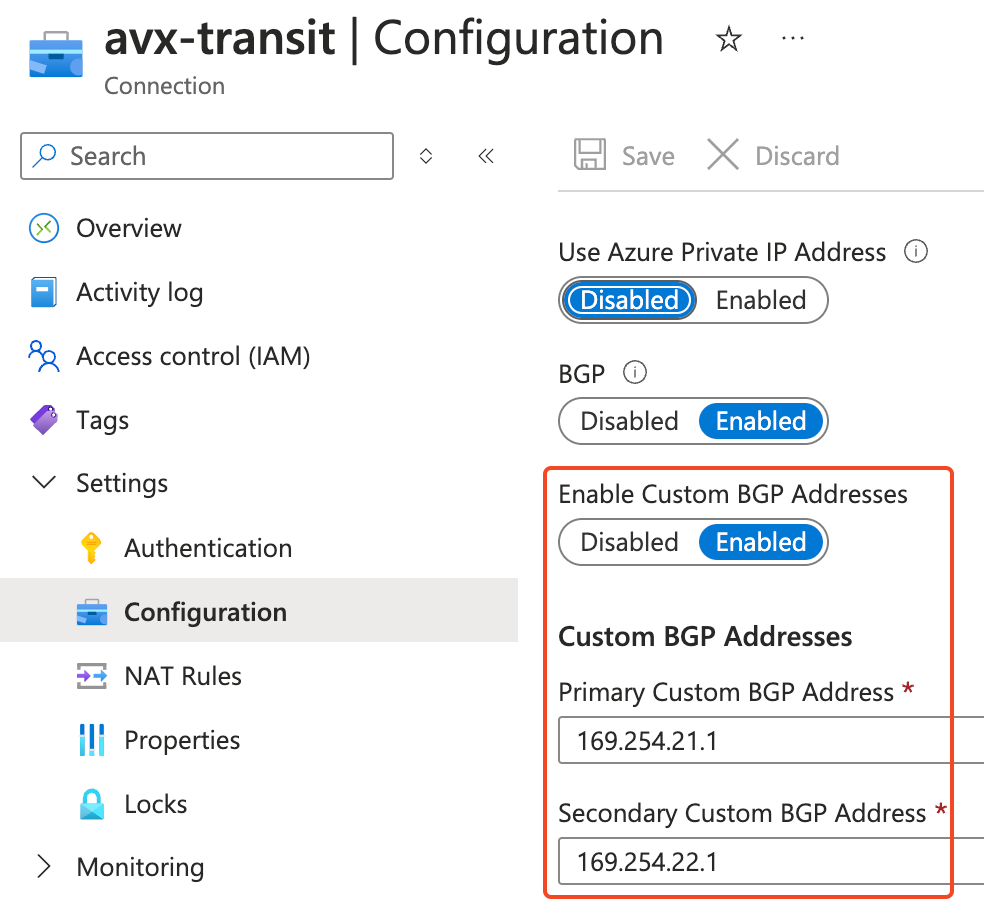

## 2024-May-22
- On VNG connection to Aviatrix Transits, enable "Enable Custom BGP Addresses"
Select the VNG side primary/secondary APIPA address


- In case VNG has multiple APIPA address assigned, for example
- Primary VNG instance:
    - 169.254.21.1
    - 169.254.21.5
- Secondary VNG instance:
    - 169.254.22.1
    - 169.254.22.5
- If the Aviatrix side wants to use 169.254.21.6/30 and 169.254.22.6/30 to connect to 169.254.21.5 and 169.254.22.5, if "Enable Custom BGP Addresses" is disabled or wrong address pair is selected:
    - on Aviatrix side, when we check received routes from neighbour 169.254.21.5, it will receive all the routes, but next hop is set to 169.254.21.1, which is the first APIPA address from the primary VNG instance APIPA addresses list [169.254.21.1, 169.254.21.5]
    ```
        av-gw-temp-transit# show ip bgp neighbors 169.254.21.5 received-routes
    BGP table version is 0, local router ID is 169.254.21.6
    Status codes: s suppressed, d damped, h history, * valid, > best, = multipath,
                i internal, r RIB-failure, S Stale, R Removed
    Origin codes: i - IGP, e - EGP, ? - incomplete
    Network          Next Hop            Metric LocPrf Weight Path
    *> 10.0.10.0/24     169.254.21.1                           0 65010 i
    *> 10.0.20.0/24     169.254.21.1                           0 65010 i
    *> 10.100.0.0/23    169.254.21.1                           0 65010 65001 i
    *> 10.200.0.0/23    169.254.21.1                           0 65010 65001 i
    *> 169.254.22.6/32  169.254.21.1                           0 65010 i
    ```
    - Aviatrix won't install the route into gateway route table, as the next hop doesn't match neighbour IP of 169.254.21.5/30

    - It will be difficult to troubleshot at this point, as no alerts will be made and "show ip bgp" would list all the routes received by zebra, except they won't get programmed to Aviatrix Gateway Route table.